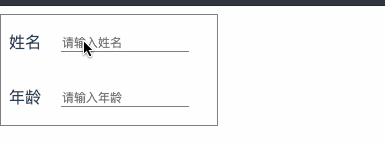

# vue-components

## 前言

平时工作中积累的一些觉得可以方便自定义的小组件 🍉,空闲之余整理一些出来,多思考下大佬的设计模式,顺便分享出来供大家看看:smile::smile::smile:

基本上,组件都是基于Vue写的,样式上也是针对一些业务场景的,方便自行更换图片就可以改造成自己想要的样式,稍微改造下也可以改成原生js,有许多不足的地方,需要多多改进吧.

> 拉取本代码下来,下载依赖之后可以直接运行

## 技术涉及
`Vue` `JavaScript` `less` 

## 组件列表
- [x] Form验证表达组件
- [ ] 自定义灯光滑动条
- [ ] 走马灯
- [ ] 模拟窗帘开关控制
- [ ] 音量控制

> 持续更新中...

## 效果截图

## 目录介绍

├── src                                         // 源码目录
│   ├── components                              // 组件
│   │   ├── Form

