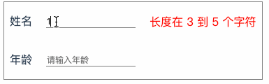
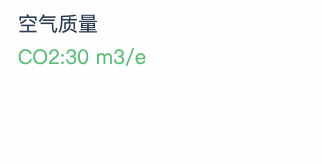
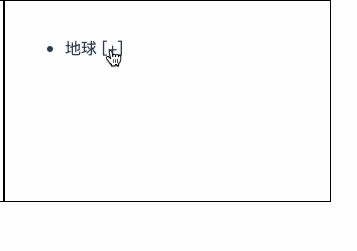
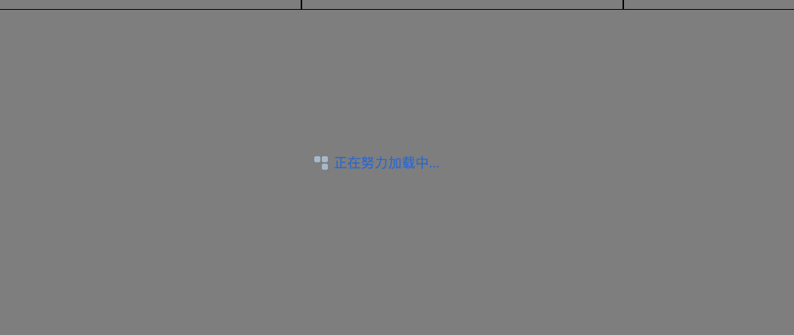
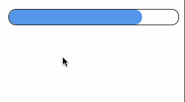
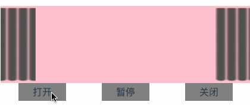

# vue-components

## 前言

平时工作中积累的一些觉得可以方便自定义的小组件 🍉,空闲之余整理一些出来,多思考下大佬的设计模式,顺便分享出来供大家看看:smile::smile::smile:

基本上,组件都是基于Vue写的,样式上也是针对一些业务场景的,方便自行更换图片就可以改造成自己想要的样式,稍微改造下也可以改成原生js,有许多不足的地方,需要多多改进吧.

> 拉取本代码下来,下载依赖之后可以直接运行

## 技术涉及
`Vue` `JavaScript` `less` 

## 组件列表
- [x] Form验证表达组件
- [x] 自定义灯光滑动条
- [x] 走马灯
- [x] 模拟窗帘开关控制
- [x] Tree树组件
- [x] Loading加载界面

> 持续更新中...

## 效果截图
1. 自定义表单 

2. 文字走马灯 

3. Tree 

4. Loading 

5. Light 

6. Curtain 

## 目录介绍

|----------  &nbsp;&nbsp; src   &nbsp;&nbsp;// 源码 
| &nbsp;&nbsp;&nbsp;|---------- &nbsp;&nbsp;components   &nbsp;&nbsp;// 组件文件夹 
| &nbsp;&nbsp;&nbsp;| &nbsp;&nbsp;&nbsp;|---------- &nbsp;&nbsp; Form    &nbsp;&nbsp;// 自定义表单组件 
| &nbsp;&nbsp;&nbsp;| &nbsp;&nbsp;&nbsp;|---------- &nbsp;&nbsp; Carousel    &nbsp;&nbsp;// 文字走马灯 
| &nbsp;&nbsp;&nbsp;| &nbsp;&nbsp;&nbsp;|---------- &nbsp;&nbsp; Tree    &nbsp;&nbsp;// 树形列表 
| &nbsp;&nbsp;&nbsp;| &nbsp;&nbsp;&nbsp;|---------- &nbsp;&nbsp; Loading    &nbsp;&nbsp;// 加载界面 
| &nbsp;&nbsp;&nbsp;| &nbsp;&nbsp;&nbsp;|---------- &nbsp;&nbsp; Light    &nbsp;&nbsp;// 灯 
| &nbsp;&nbsp;&nbsp;| &nbsp;&nbsp;&nbsp;|---------- &nbsp;&nbsp; Curtain    &nbsp;&nbsp;// 窗帘 
